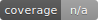

# InstructifyAI

[](https://github.com/InstructifyAI/InstructifyAI/actions/workflows/ci.yml)
[](coverage.svg)

## Quick Start (WSL2 & macOS)

1. Ensure Docker Desktop is running. On Windows, use a WSL2 terminal; on macOS use the native shell.
2. Start the stack:
   ```bash
   make dev
   ```
   If you change worker dependencies or the Dockerfile, rebuild the image (run in WSL on Windows):
   ```bash
   docker compose build worker
   ```
3. Apply database migrations:
   ```bash
   make migrate
   ```
4. (Optional) Run the demo on bundled samples:
   ```bash
   make demo
   ```
5. Launch Label Studio and configure the webhook:
   - `docker run -it -p 8080:8080 heartexlabs/label-studio:latest`
   - Set `LS_BASE_URL` and `LS_API_TOKEN` in your `.env` to point to the instance.
   - Open <http://localhost:8080> and add a webhook pointing to `http://host.docker.internal:8000/webhooks/label-studio`.
6. Import the Postman collection and environment from `docs/postman/` or try the API with curl:
   ```bash
   curl http://localhost:8000/health
   curl -H "X-Role: viewer" "http://localhost:8000/projects?limit=20&offset=0&q=dev"
   curl -X POST http://localhost:8000/export/jsonl \
     -H "Authorization: Bearer $JWT" \
     -H "Content-Type: application/json" \
     -d '{"doc_ids":["DOC_ID"]}'
   ```

## Curation API

Phase‑1 exposes endpoints for managing a per‑project taxonomy and for applying
curation metadata to chunks. Endpoints require an `Authorization: Bearer <jwt>`
header with a `role` claim. In `ENV=DEV`, you may override the role using
`X-Role`. Only `curator` may modify data while `viewer` can read.

* `POST /projects` – create a new project and return its `id`.
* `PUT /projects/{project_id}/taxonomy` – create a new taxonomy version with
  field definitions including `helptext` and `examples`.
* `GET /projects/{project_id}/taxonomy/guidelines` – return labeling guidelines
  (JSON or markdown) for the active taxonomy.
* `POST /label-studio/config?project_id=...` – render a Label Studio project configuration from the active taxonomy; paste the XML into Label Studio's "Labeling configuration" panel under Settings → Labeling Interface.
* `POST /webhooks/label-studio` – apply a metadata patch from a Label Studio
  webhook and append an audit entry.
* `POST /chunks/bulk-apply` – apply a metadata patch to many chunks at once,
  selecting by `chunk_ids` or `doc_id`+`range`; writes an audit row per chunk.
* `POST /chunks/{chunk_id}/suggestions/{field}/accept` – accept a rule-based
  suggestion for a single chunk.
* `POST /chunks/accept-suggestions` – accept a suggestion across many chunks.
* `GET /documents/{doc_id}/metrics` – return curation completeness metrics.
* `GET /audits?doc_id=&user=&action=&since=` – list audit entries (JSON or CSV via `Accept: text/csv`).

Each request is stamped with an `X-Request-ID` correlation identifier that
propagates to Celery tasks and audit rows.

Run `make scorecard` to execute the scorecard CLI on the golden set and enforce
curation completeness thresholds.

Audits are stored in the `audits` table with before/after values for each
change.
