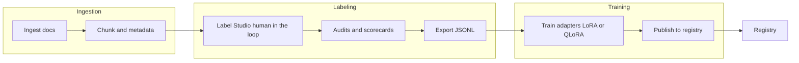
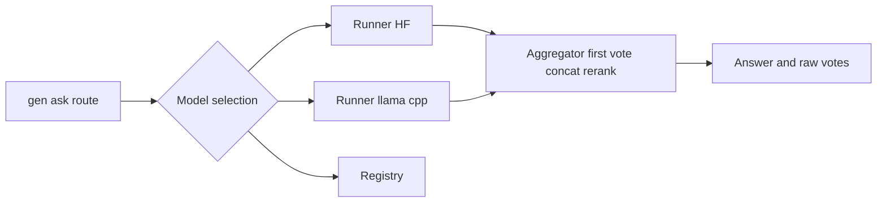
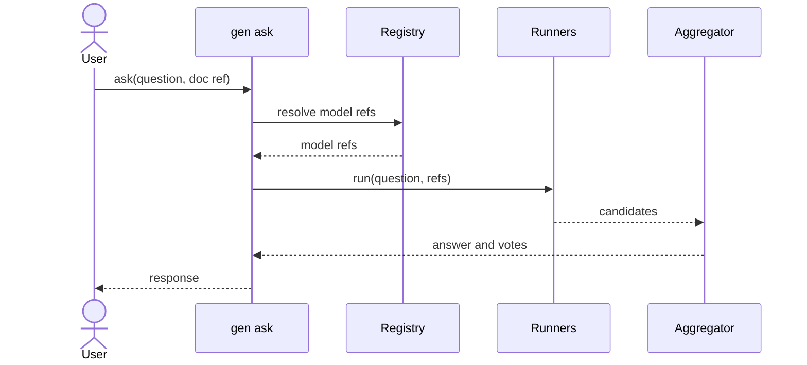

# Architecture & Data Flow

Offline pipeline (prepare)

Online Path Serve

Minimal sequence for the request flow

**Deployment Footprint**

* Containers: API, Worker, DB, Redis, MinIO, LS, (optional) Generator
* Feature flag: `FEATURE_DOC_BINDINGS` (default: true)
* Note: `document_id` is the canonical field; `doc_id` alias is accepted at API boundary.
